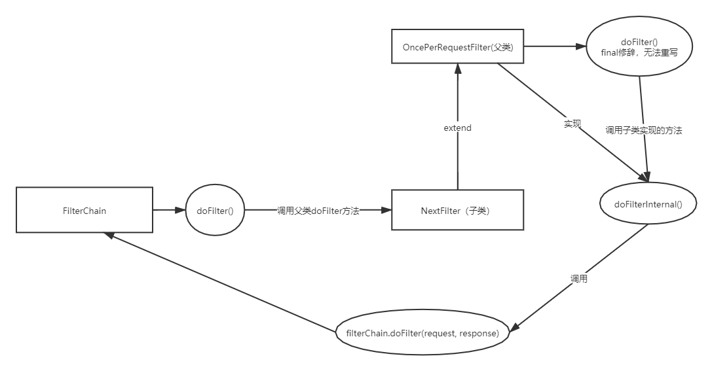
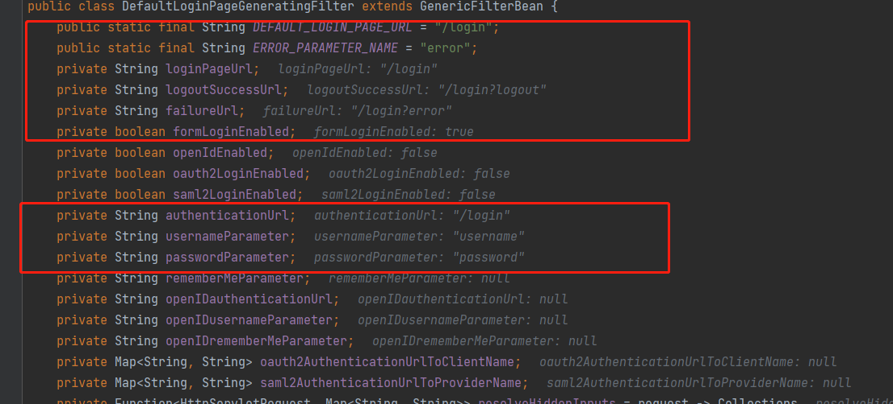

# 再战springsecurity之手撕源码！！！


在使用默认配置的时候登录请求是在这里进行处理的

+  第一个概念，过滤器**Filter**，**Filter**是**Servlet**提供的对请求到达的时候进行特定的处理的一个接口

  ```java
  public interface Filter {
  
      /**
       * 初始化调用一次
       */
      public default void init(FilterConfig filterConfig) throws ServletException {}
  
      /**
       * 进行处理的地方，请求到达该过滤器则调用其方法
       */
      public void doFilter(ServletRequest request, ServletResponse response,
              FilterChain chain) throws IOException, ServletException;
  
      /**
       * 过滤器销毁时调用
       */
      public default void destroy() {}
  }
  ```

+ 第二个概念，过滤器链**FilterChain**，**spring security**的原理就是提供了很多过滤器，然后将这些过滤器按照一定的顺序凭借起来对请求进行不同的处理，**Servlet**提供了一个接口**FilterChain**和实现类**ApplicationFilterChain**

  ```java
  public interface FilterChain {
  
      /**
       * 有了FilterChain之后，由FilterChain获取当前的Filter实例然后调用Filter的doFilter()方法
       */
      public void doFilter(ServletRequest request, ServletResponse response)
              throws IOException, ServletException;
  
  }
  ```

+ 第三个概念**OncePerRequestFilter**，这是一个抽象类，绝大部分过滤器都直接或者间接继承这个类，这个类的功能是保证每个过滤器只执行一次，其实现原理如下：

  + 首先他实现了**Filter**接口并重写了**doFilter**方法

  + ```java
    @Override
    public final void doFilter(ServletRequest request, ServletResponse response, FilterChain filterChain)
          throws ServletException, IOException {
    
       if (!(request instanceof HttpServletRequest) || !(response instanceof HttpServletResponse)) {
          throw new ServletException("OncePerRequestFilter just supports HTTP requests");
       }
       HttpServletRequest httpRequest = (HttpServletRequest) request;
       HttpServletResponse httpResponse = (HttpServletResponse) response;
    	//获取request的alreadyFilteredAttributeName属性，判断是否已经执行过
       String alreadyFilteredAttributeName = getAlreadyFilteredAttributeName();
       boolean hasAlreadyFilteredAttribute = request.getAttribute(alreadyFilteredAttributeName) != null;
    	//判断是否需要跳过过滤器
       if (skipDispatch(httpRequest) || shouldNotFilter(httpRequest)) {
    
          // Proceed without invoking this filter...
          filterChain.doFilter(request, response);
       }
        //判断是否已经执行过
       else if (hasAlreadyFilteredAttribute) {
    		
          if (DispatcherType.ERROR.equals(request.getDispatcherType())) {
             doFilterNestedErrorDispatch(httpRequest, httpResponse, filterChain);
             return;
          }
    
          // Proceed without invoking this filter...
           //如果已经执行则执行下一个过滤器
          filterChain.doFilter(request, response);
       }
       else {
          // Do invoke this filter...
           //执行该过滤器，并且设置alreadyFilteredAttributeName属性，这样可以标识该过滤器已经执行
          request.setAttribute(alreadyFilteredAttributeName, Boolean.TRUE);
          try {
              //真正的过滤器业务代码在该类的抽象方法里面，具体怎么做由子类实现之后再通过父类的doFilter调用
             doFilterInternal(httpRequest, httpResponse, filterChain);
          }
          finally {
             // Remove the "already filtered" request attribute for this request.
             request.removeAttribute(alrea	dyFilteredAttributeName);
          }	
       }
    }
    ```

    该方法被**final**修辞，无法被重写，所以继承了该类的过滤器都会进行判断，然后调用子类实现该类的**doFilterInternal**方法进行真实的业务处理，然后在实现方法中回调**filterChain.doFilter(request, response)**通知过滤器链进行下一个操作，其顺序大概如下图所示：

    

+  org.springframework.security.web.authentication.ui.DefaultLoginPageGeneratingFilter#doFilter

```java
public void doFilter(ServletRequest req, ServletResponse res, FilterChain chain)
      throws IOException, ServletException {
   HttpServletRequest request = (HttpServletRequest) req;
   HttpServletResponse response = (HttpServletResponse) res;

   boolean loginError = isErrorPage(request);
   boolean logoutSuccess = isLogoutSuccess(request);
    //isLoginUrlRequest(request)判断是否为ContextPath/login，
    //如果是登录请求或者登出或者登陆异常，则generateLoginPageHtml()返回html页面，  详细见下图
   if (isLoginUrlRequest(request) || loginError || logoutSuccess) {
      String loginPageHtml = generateLoginPageHtml(request, loginError,
            logoutSuccess);
      response.setContentType("text/html;charset=UTF-8");
      response.setContentLength(loginPageHtml.getBytes(StandardCharsets.UTF_8).length);
      response.getWriter().write(loginPageHtml);

      return;
   }

   chain.doFilter(request, response);
}
```



如果不是登陆相关请求，则放行


+  **AbstractAuthenticationProcessingFilter** 处理登录请求的过滤器

```java
	public void doFilter(ServletRequest req, ServletResponse res, FilterChain chain)
			throws IOException, ServletException {

		HttpServletRequest request = (HttpServletRequest) req;
		HttpServletResponse response = (HttpServletResponse) res;
		//判断是否为需要做验证
		if (!requiresAuthentication(request, response)) {
			chain.doFilter(request, response);

			return;
		}

		if (logger.isDebugEnabled()) {
			logger.debug("Request is to process authentication");
		}

		Authentication authResult;

		try {
            //验证具体实现，参考其子类
			authResult = attemptAuthentication(request, response);
			if (authResult == null) {
				// return immediately as subclass has indicated that it hasn't completed
				// authentication
				return;
			}
			sessionStrategy.onAuthentication(authResult, request, response);
		}
		catch (InternalAuthenticationServiceException failed) {
			logger.error(
					"An internal error occurred while trying to authenticate the user.",
					failed);
			unsuccessfulAuthentication(request, response, failed);

			return;
		}
		catch (AuthenticationException failed) {
			// Authentication failed
			unsuccessfulAuthentication(request, response, failed);

			return;
		}

		// Authentication success
		if (continueChainBeforeSuccessfulAuthentication) {
			chain.doFilter(request, response);
		}

		successfulAuthentication(request, response, chain, authResult);
	}
```

